# Tech Stock Forecasting with Two-Tier Optimization

A research project that builds a **two-tier optimization framework** for forecasting and trading U.S. technology stocks (the "Magnificent Seven": AAPL, MSFT, AMZN, META, NVDA, GOOGL, TSLA). The framework combines Genetic Algorithms (GA), Bayesian Optimization (BO), and NSGA-II multi-objective search to tune two model families — **ARIMA-GARCH** and **LSTM** — not just for forecast accuracy, but for real trading performance.

---

## Table of Contents

- [Project Overview](#project-overview)
- [Data](#data)
- [Feature Engineering](#feature-engineering)
- [Models](#models)
- [Optimization Framework](#optimization-framework)
- [Backtesting](#backtesting)
- [Results](#results)
- [Project Structure](#project-structure)
- [Installation](#installation)
- [Running the Project](#running-the-project)

---

## Project Overview

Most time-series forecasting research stops at minimizing prediction error (e.g., RMSE). This project argues that **a good forecast does not always translate to a good trading strategy**. The two-tier framework addresses this gap:

- **Tier 1** — optimizes the model for *forecasting accuracy* (minimize RMSE)
- **Tier 2** — optimizes the strategy for *trading performance* (jointly maximize Sharpe Ratio and minimize Maximum Drawdown)

Two model families are compared:
- **ARIMA-GARCH**: a classical econometric model, interpretable and stable, with explicit volatility modeling via GARCH
- **LSTM**: a deep learning model that captures nonlinear patterns across multiple input features

The project covers the full pipeline: data download → preprocessing → walk-forward fold generation → hyperparameter tuning → backtesting → performance analysis.

---

## Data

- **Source**: Yahoo Finance via `yfinance`
- **Tickers**: AAPL, MSFT, AMZN, META, NVDA, GOOGL, TSLA ("Magnificent Seven")
- **Period**: January 2010 – December 2020 (2,768 trading days after calendar alignment)
- **Train/val cutoff**: November 30, 2019 — yielding ~16,597 rows for training/validation and 1,771 rows for the test set
- **IPO filtering**: rows before a company's IPO date are dropped (e.g., META before 2012-05-18, TSLA before 2010-06-29)

Raw OHLCV data is stored in `dataset/` as one CSV per ticker.

### Exploratory Data Analysis

Price levels, log return distributions, rolling volatility, and seasonal decomposition are computed for each ticker:

| AAPL Price Level | AAPL Log Returns |
|---|---|
| 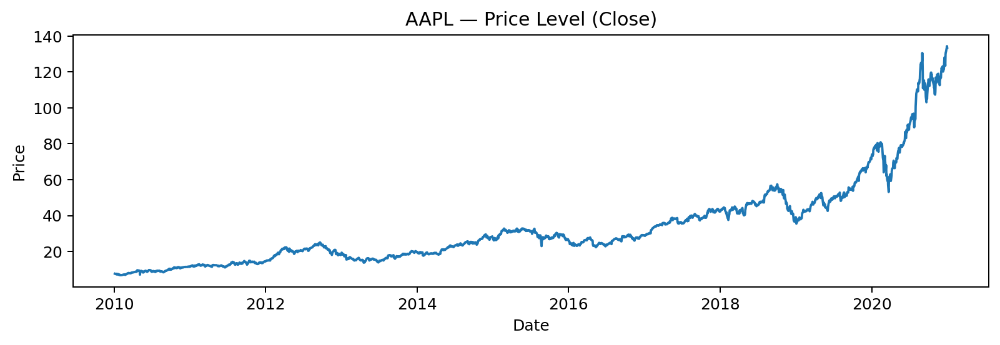 | 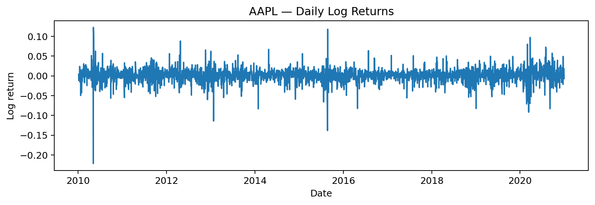 |

Log returns across all tickers show positive skew and fat tails. Volatility clustering is clearly visible for high-volatility names:

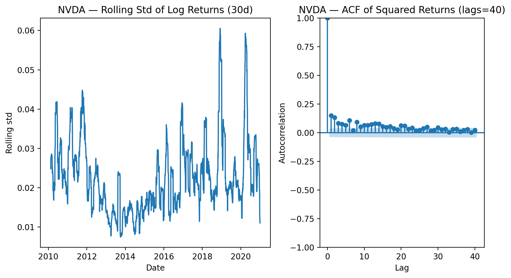

---

## Feature Engineering

Preprocessing applies to the raw OHLCV data before model training.

### Transformations
- **Log returns** from adjusted close prices (target series for ARIMA)
- **Box-Cox transform** on price columns (OHLC)
- **Yeo-Johnson transform** on volume (handles negatives from differencing)
- **ADF stationarity test** confirms log returns are stationary (no differencing needed, ARIMA `d=0`)

### Technical Indicators
| Indicator | Description |
|---|---|
| SMA(5) | 5-day simple moving average |
| TEMA(12), TEMA(26) | Triple Exponential Moving Average |
| RSI(7), RSI(14) | Relative Strength Index |
| Bollinger Bands | Window 10 & 20, ±1.5σ and ±2σ bands |
| OBV | On-Balance Volume |
| HLC3 | (High + Low + Close) / 3 |
| Lagged features | 1, 3, 5-day lags on Close, HLC3, RSI, OBV, Log_Returns |

### Dimensionality Reduction (LSTM only)
A global **PCA** is fit on the union of all LSTM training folds and applied consistently across folds to reduce collinear features before feeding into the LSTM.

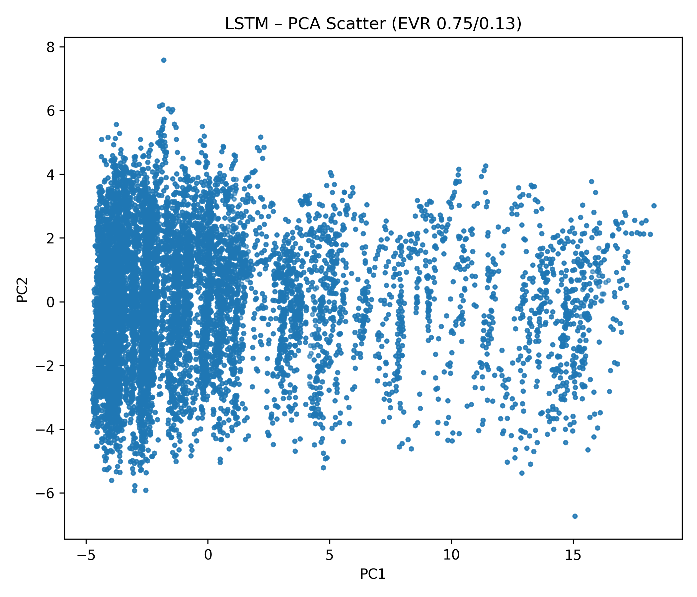

### Walk-Forward Folds
Both models use **walk-forward cross-validation**: each fold has a fixed training window followed by a validation window that advances through time. Folds are generated at retrain intervals of **10, 20, and 42 trading days**.

To avoid running all ~650 folds through expensive optimization, **K-means clustering on fold meta-features** (trend, volatility, autocorrelation statistics) is used to select a representative subset:
- ARIMA: **11 representative folds** (IDs: 35, 80, 113, 206, 226, 259, 343, 347, 444, 584, 634)
- LSTM: **14 representative folds** (IDs: 3, 35, 159, 206, 216, 246, 347, 364, 400, 444, 553, 564, 599, 652)


---

## Models

### ARIMA-GARCH

ARIMA(p, 0, q) is fitted on log returns (d=0 since log returns are already stationary). Order ranges: p, q ∈ [1, 7].

GARCH(1,1) is then fitted on ARIMA residuals to model **conditional volatility**. The innovation distribution (Normal vs. Student-t) is selected automatically per fitting block by minimizing AIC, with BIC and HQIC as tiebreakers. Student-t is consistently preferred across folds, reflecting fat-tailed return distributions.

ACF/PACF plots guide prior understanding of lag structure:

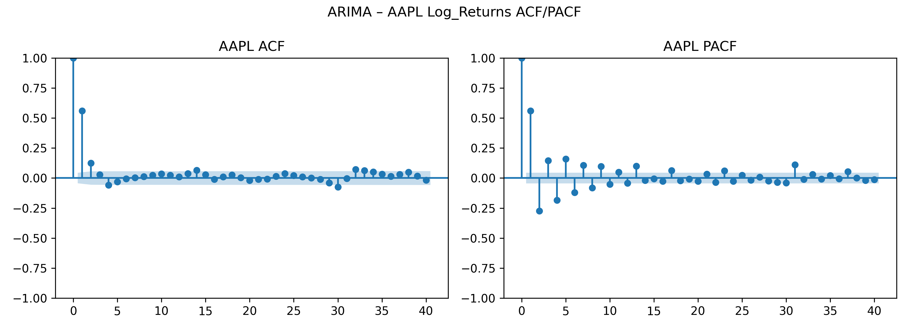

### LSTM

A Sequential LSTM with:
- 1–3 stacked LSTM layers
- **BatchNorm** (batch size > 32) or **LayerNorm** (batch size ≤ 32)
- Dropout regularization
- Dense output layer
- Adam optimizer with EarlyStopping

Inputs are PCA-reduced multi-feature windows (sliding window approach). The LSTM learns nonlinear dependencies across the technical indicator feature set.

---

## Optimization Framework

The framework has two tiers, each combining a **global evolutionary search** with a **local Bayesian refinement**.

### Tier 1 — Forecast-Oriented Optimization

**Goal**: minimize validation RMSE

| Step | Method | Details |
|---|---|---|
| Global search | **GA** (pymoo `GA`) | Population of 40, 30 generations; searches ARIMA (p,q) or LSTM (layers, batch_size, dropout) |
| Local refinement | **BO** (`skopt gp_minimize`) | 50 function evaluations starting from top GA seeds; Gaussian Process surrogate with Expected Improvement |

Tier-1 seeds the best solutions forward into Tier-2 to warm-start the population.

### Tier 2 — Trading-Oriented Optimization

**Goal**: jointly maximize Sharpe Ratio and minimize Maximum Drawdown (two competing objectives)

| Step | Method | Details |
|---|---|---|
| Global search | **NSGA-II** (pymoo) | Multi-objective EA; evolves Pareto front over Sharpe vs. MDD |
| Local refinement | **ParEGO BO** | Scalarizes multi-objective problem via random weight vectors; GP with Matern-2.5 kernel + Expected Improvement |

ARIMA Tier-2 optimizes (p, q, threshold); LSTM Tier-2 optimizes (window, units, lr, epochs, rel_thresh).

**Hypervolume (HV)** indicator measures Pareto front quality across generations. GA+BO improves HV over pure GA in the majority of folds.


### Knee-Point Selection

The Pareto front contains many trade-off solutions between high Sharpe (aggressive) and low MDD (conservative). A **knee point** is selected as the deployable strategy: the solution with minimum normalized Euclidean distance to the origin of the normalized objective space, balancing both objectives.

### Trading Signal Generation

- **ARIMA**: continuous z-score sizing — `position = clip(ARIMA_forecast / (GARCH_vol × threshold), −1, +1)`. The threshold is a Tier-2 hyperparameter controlling aggressiveness.
- **LSTM**: binary signal (0 or 1) based on a percentile threshold with **hysteresis** (avoids rapid signal flipping) and a **MAD guardrail** (median absolute deviation check for signal robustness).

---

## Backtesting

Walk-forward backtesting is run on the **held-out test set (2019-12-01 to 2020-12-30)** using the Tier-2 knee-point parameters.

**Setup:**
- Retrain intervals: 10, 20, and 42 trading days
- Transaction costs: 0.05% base cost + 0.02% slippage per unit of turnover
- Models compared: GA+BO knee, GA-only knee, Buy-and-Hold baseline

**Metrics computed per fold/interval:**
- Annualized Sharpe Ratio (√252 scaling)
- Maximum Drawdown (MDD)
- Annualized Return
- Annualized Volatility
- Turnover

Per-fold outputs include equity curves, rolling Sharpe, rolling drawdown, and cumulative return vs. buy-and-hold.

---

## Results

### ARIMA-GARCH Backtest Summary

| Retrain Interval | Median Sharpe | Median MDD | Median Ann. Return |
|---|---|---|---|
| 10 days | 1.39 | 10.7% | 10.9% |
| 20 days | 1.48 | 7.7% | 11.0% |
| 42 days | 1.50 | 9.0% | 10.3% |

**Overall (GA+BO knee, all 33 fold/interval combinations):**
- Mean Sharpe: **1.44** | Median Sharpe: **1.43**
- Mean MDD: **12.8%** | Median MDD: **9.2%**
- Mean Ann. Return: **18.4%** | Median Ann. Return: **10.7%**

### Buy-and-Hold Baseline

The buy-and-hold strategy over the same test period (2020) achieved:
- Sharpe: **1.70** | MDD: **61.1%** | Ann. Return: **81.2%**

The buy-and-hold has a higher Sharpe in a bull year, but with catastrophically higher drawdown. The optimized strategies achieve **substantially lower MDD** (9–13% vs. 61%) — the primary design objective for the Tier-2 optimization.

### HV Improvement: GA+BO vs. GA only

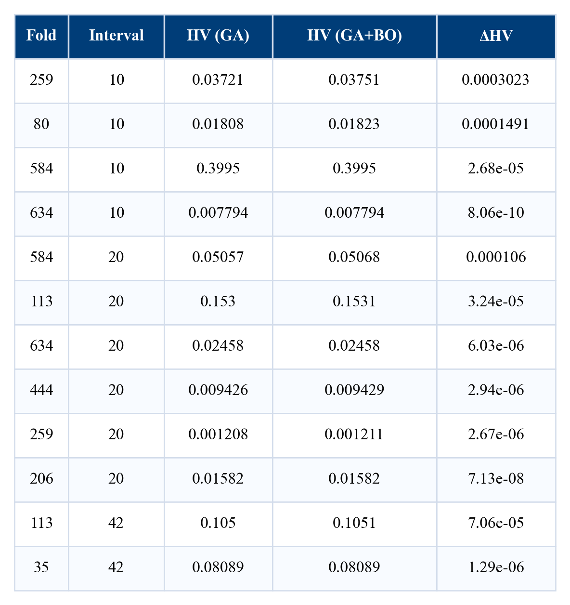

GA+BO produces a higher hypervolume (better Pareto front) than GA alone in the majority of folds, confirming that the Bayesian local refinement step adds value.

### Backtest Performance Tables

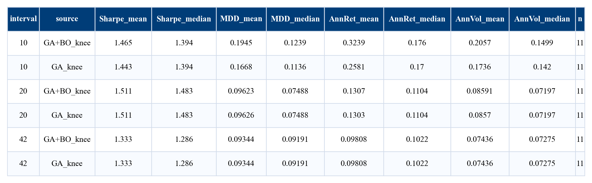

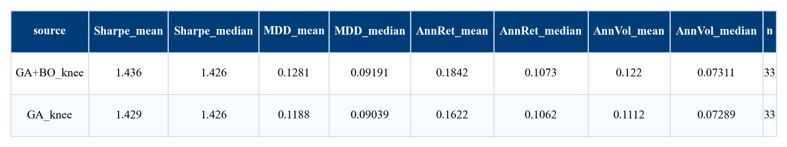

### Equity and Cumulative Return Grids

Sample equity curves and cumulative return profiles across representative folds:

| ARIMA Equity Curves | ARIMA Cumulative Returns |
|---|---|
| See `figures/grids_equity/equity_arima_grid_3x2.pdf` | See `figures/grids_cumret/cumret_arima_grid_3x2.pdf` |

### Line Profiles: Performance vs. Retrain Interval

Sharpe, MDD, and turnover as a function of the retrain interval:

| Sharpe | MDD | Turnover |
|---|---|---|
| 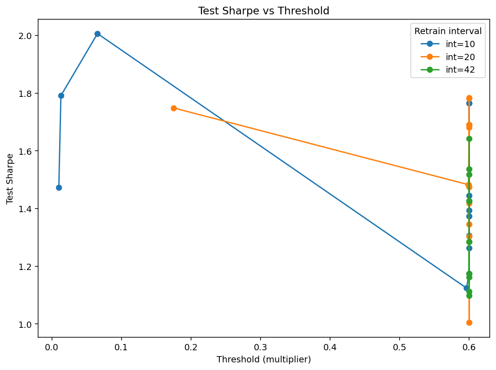 | 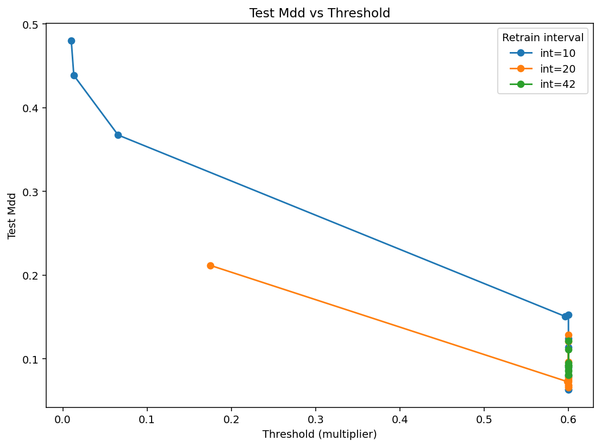 | 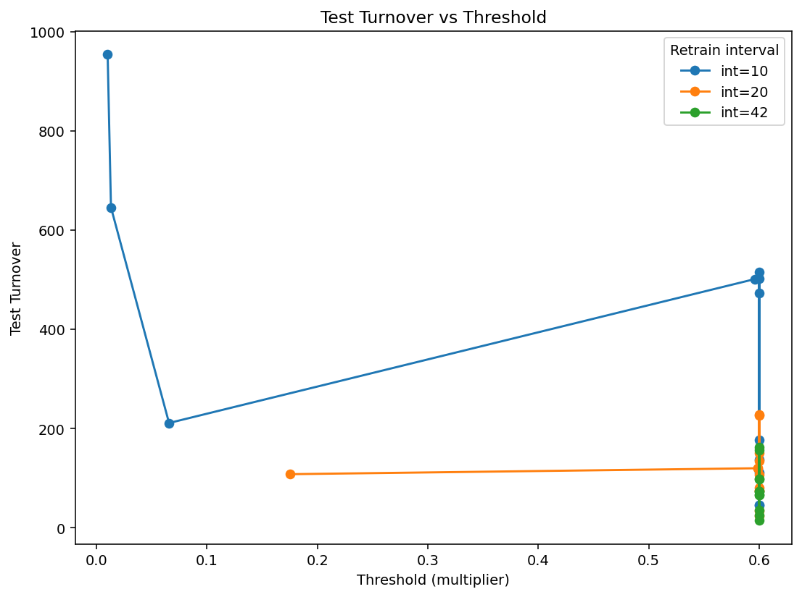 |

Longer retrain intervals (42 days) tend to produce slightly better Sharpe with lower MDD, at the cost of less frequent adaptation.

### Box Plots: Distribution of Sharpe and MDD Across Folds

| ARIMA Sharpe | ARIMA MDD |
|---|---|
| 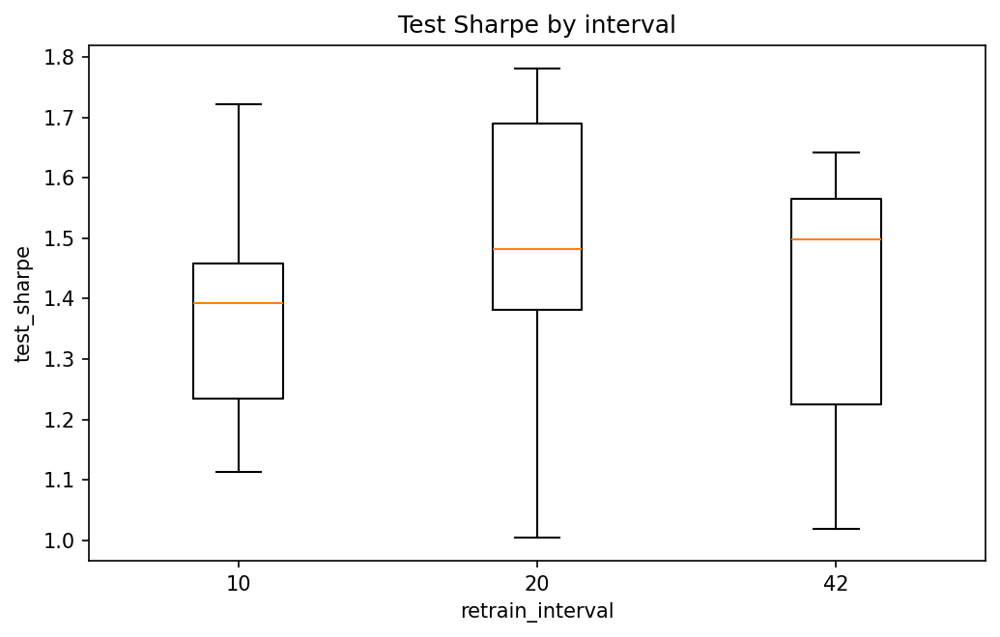 | 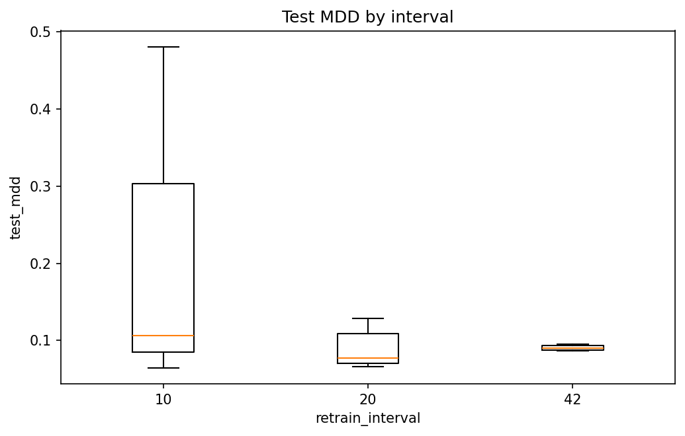 |

---

## Project Structure

```
tech-stock-forecasting/
├── dataset/                        # Raw per-ticker CSVs from yfinance
├── data/processed_folds/           # Generated walk-forward fold CSVs
├── tuning_results/                 # Hyperparameter tuning outputs
│   ├── csv/                        # Tier-1 and Tier-2 results (ARIMA + LSTM)
│   ├── backtest_arima/             # Per-fold ARIMA backtest results
│   ├── backtest_lstm/              # Per-fold LSTM backtest results
│   ├── baselines/                  # Buy-and-hold and random walk baselines
│   └── chap5/                      # Aggregate tables and summary PNGs
├── figures/                        # All charts and visualization outputs
│   ├── AAPL/ AMZN/ GOOGL/ ...      # Per-ticker EDA plots
│   ├── arima/ lstm/                # ACF/PACF, distributions, Pareto fronts
│   ├── grids_equity/               # Multi-fold equity curve PDFs
│   ├── grids_cumret/               # Multi-fold cumulative return PDFs
│   ├── grids_hv/                   # Hypervolume convergence PDFs
│   ├── grids_best_knee/            # Best vs. knee Pareto comparison PDFs
│   ├── line_profiles/              # Sharpe/MDD/turnover vs. interval
│   ├── tables/                     # Summary statistics tables (PNG)
│   ├── tier2_arima/ tier2_lstm/    # Per-fold Pareto front and HV plots
│   ├── vol_clustering/             # Volatility clustering charts
│   └── additional results/        # Cross-section and EDA charts
├── agg_plots_arima/                # Aggregate box plots and mean equity curves
├── agg_plots_lstm/                 # Same for LSTM
├── viz_outputs/                    # Per-fold equity/rolling metric PNGs
├── cumret_outputs/                 # Per-fold cumulative return PNGs
├── feature_analysis/               # Feature correlation heatmaps per fold
│
├── preprocessing_data_for_tuning.ipynb  # Full data pipeline notebook
├── arima_visualize.ipynb                # ARIMA results visualization notebook
├── lstm_visualize.ipynb                 # LSTM results visualization notebook
│
├── arima_utils.py                  # ARIMA+GARCH model, objectives, pymoo problems
├── lstm_utils.py                   # LSTM model, objectives, ParEGO BO helpers
│
├── tier1_arima_tuning.py           # Tier-1 ARIMA: GA + BO (minimize RMSE)
├── tier2_arima_tuning.py           # Tier-2 ARIMA: NSGA-II + ParEGO BO
├── tier1_lstm_tuning.py            # Tier-1 LSTM: GA + BO (minimize RMSE)
├── tier2_lstm_tuning.py            # Tier-2 LSTM: NSGA-II + ParEGO BO
│
├── generate_fold_arima.py          # Walk-forward fold generation for ARIMA
├── generate_fold_lstm.py           # Walk-forward fold generation for LSTM
├── final_scaler_and_pca.py         # GlobalScaler + PCA fit and serialization
├── select_rep_folds.py             # K-means fold representative selection
├── build_meta_features.py          # Meta-feature vectors for fold clustering
│
├── backtest_arima.py               # ARIMA walk-forward backtesting
├── backtest_lstm.py                # LSTM walk-forward backtesting
├── baseline_bh_unified.py          # Buy-and-hold baseline
├── baseline_rwd.py                 # Random-walk RMSE baseline
│
├── aggregate_backtest_arima.py     # Aggregate ARIMA results across folds
├── aggregate_backtests_lstm.py     # Same for LSTM
├── cross_model_comparison.py       # ARIMA vs. LSTM comparison
│
├── make_grid_equity.py             # Generate equity curve grid PDFs
├── make_grid_cumret.py             # Generate cumulative return grid PDFs
├── make_grid_hv.py                 # Generate HV convergence grid PDFs
├── plot_tier2.py                   # Pareto front and HV plots
├── make_line.py                    # Line profile plots
│
└── requirements.txt
```

---

## Installation

**Python 3.12** is required.

```bash
# Clone the repository
git clone <repo-url>
cd tech-stock-forecasting

# Create and activate a virtual environment
python3.12 -m venv venv
source venv/bin/activate        # macOS/Linux
# venv\Scripts\activate         # Windows

# Install dependencies
pip install -r requirements.txt

# Install additional packages not in requirements.txt
pip install arch yfinance joblib
```

> **Note**: TensorFlow installation varies by platform. For GPU support, follow the [TensorFlow installation guide](https://www.tensorflow.org/install). For CPU-only: `pip install tensorflow-cpu`.

---

## Running the Project

The pipeline runs in the following order. Each step can also be run independently if intermediate outputs already exist.

### Step 1 — Download and Preprocess Data

Open and run the preprocessing notebook end-to-end:

```bash
jupyter notebook preprocessing_data_for_tuning.ipynb
```

This downloads data from Yahoo Finance, applies all transformations and feature engineering, generates the fold CSVs, fits the global PCA/scaler, and runs the fold representative selection.

Alternatively, run the scripts in sequence:

```bash
python generate_fold_arima.py
python generate_fold_lstm.py
python final_scaler_and_pca.py
python build_meta_features.py
python select_rep_folds.py
```

### Step 2 — Tier-1 Hyperparameter Tuning (Minimize RMSE)

```bash
# ARIMA Tier-1: GA + BO over (p, q) orders
python tier1_arima_tuning.py --pop-size 40 --ngen 30 --n-calls 50 --n-seeds 5

# LSTM Tier-1: GA + BO over (layers, batch_size, dropout)
python tier1_lstm_tuning.py --pop-size 40 --ngen 30 --n-calls 50 --n-seeds 5
```

Results are saved to `tuning_results/csv/tier1_arima.csv` and `tier1_lstm.csv`.

### Step 3 — Tier-2 Hyperparameter Tuning (Optimize Sharpe and MDD)

```bash
# ARIMA Tier-2: NSGA-II + ParEGO BO over (p, q, threshold)
python tier2_arima_tuning.py

# LSTM Tier-2: NSGA-II + ParEGO BO over (window, units, lr, epochs, rel_thresh)
python tier2_lstm_tuning.py
```

Results are saved to `tuning_results/csv/tier2_arima*.csv` and `tier2_lstm*.csv`, including full Pareto fronts and knee-point solutions.

### Step 4 — Backtesting

```bash
# ARIMA backtest on the test set
python backtest_arima.py

# LSTM backtest on the test set
python backtest_lstm.py

# Buy-and-hold and random-walk baselines
python baseline_bh_unified.py
python baseline_rwd.py
```

Results are saved to `tuning_results/backtest_arima/` and `tuning_results/backtest_lstm/`.

### Step 5 — Aggregate Results and Visualize

```bash
# Aggregate backtest statistics across folds and intervals
python aggregate_backtest_arima.py
python aggregate_backtests_lstm.py

# Generate grid figures (PDFs)
python make_grid_equity.py
python make_grid_cumret.py
python make_grid_hv.py

# Line profile and Pareto plots
python make_line.py
python plot_tier2.py
```

### Step 6 — Explore Results in Notebooks

```bash
jupyter notebook arima_visualize.ipynb
jupyter notebook lstm_visualize.ipynb
```

These notebooks contain detailed per-fold equity curves, Pareto front visualizations, rolling metric plots, and cross-model comparisons.

---

## Key Dependencies

| Package | Purpose |
|---|---|
| `pandas`, `numpy`, `scipy` | Data manipulation and statistics |
| `statsmodels` | ARIMA fitting |
| `arch` | GARCH(1,1) volatility modeling |
| `tensorflow` / `keras` | LSTM model |
| `pymoo` | GA and NSGA-II optimization |
| `scikit-optimize` | Bayesian optimization (GP + EI) |
| `scikit-learn` | PCA, StandardScaler, KMeans |
| `yfinance` | Yahoo Finance data download |
| `matplotlib`, `seaborn` | Visualization |
| `joblib` | Model serialization |

See `requirements.txt` for the full list.
